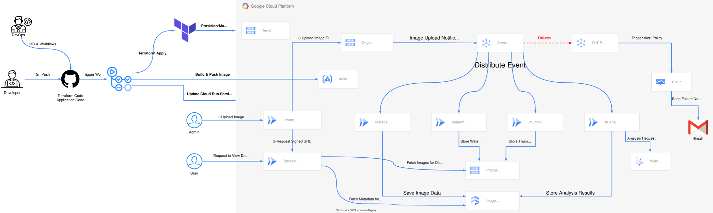
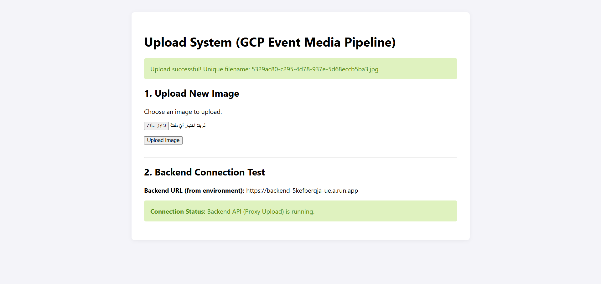
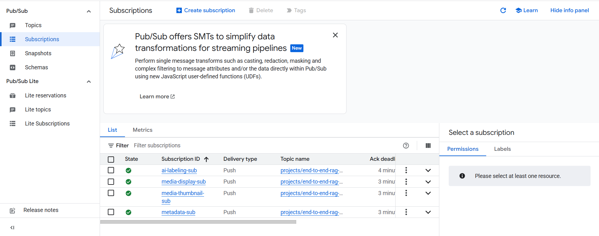
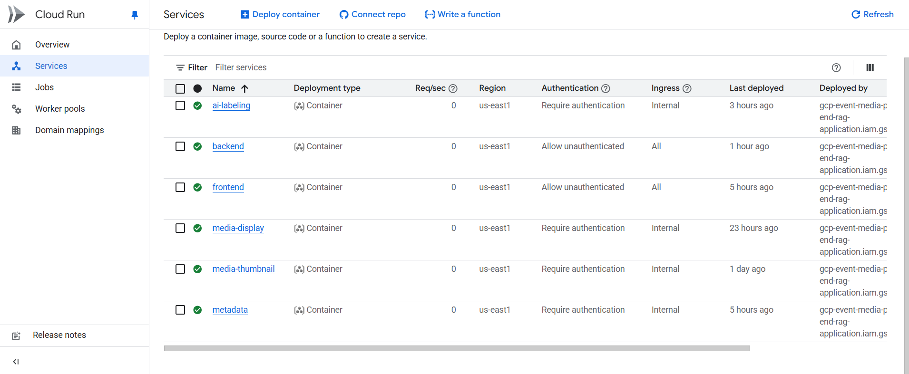
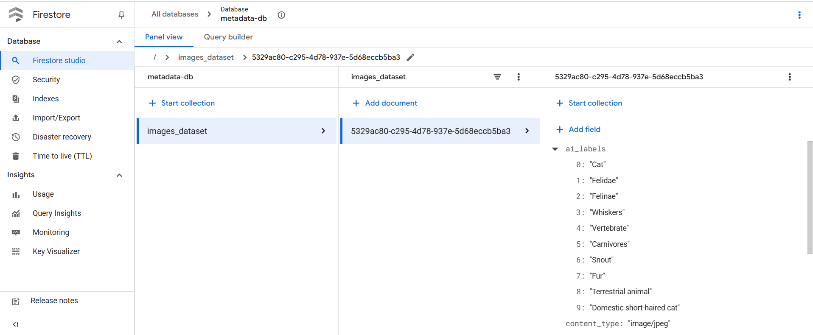
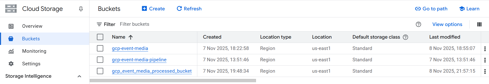
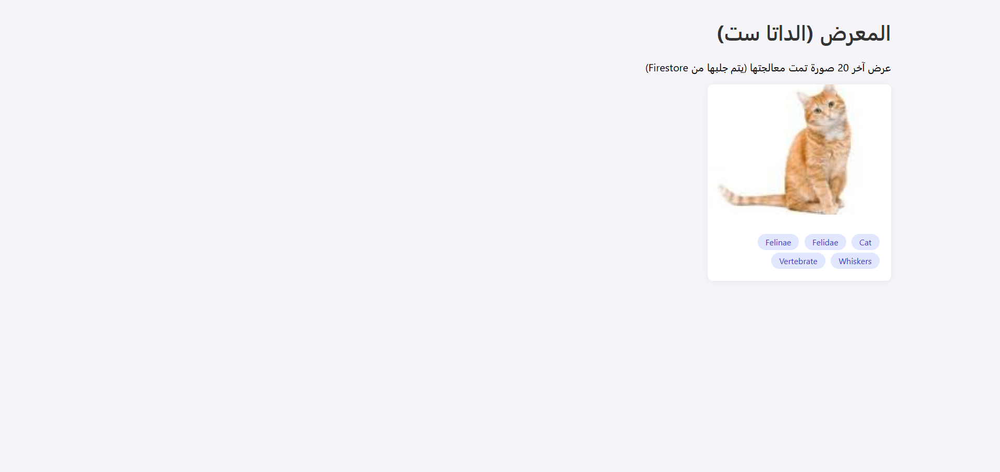
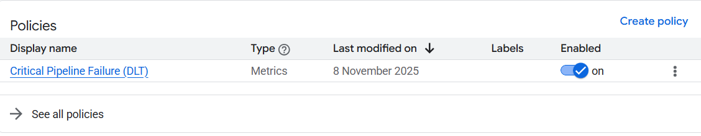
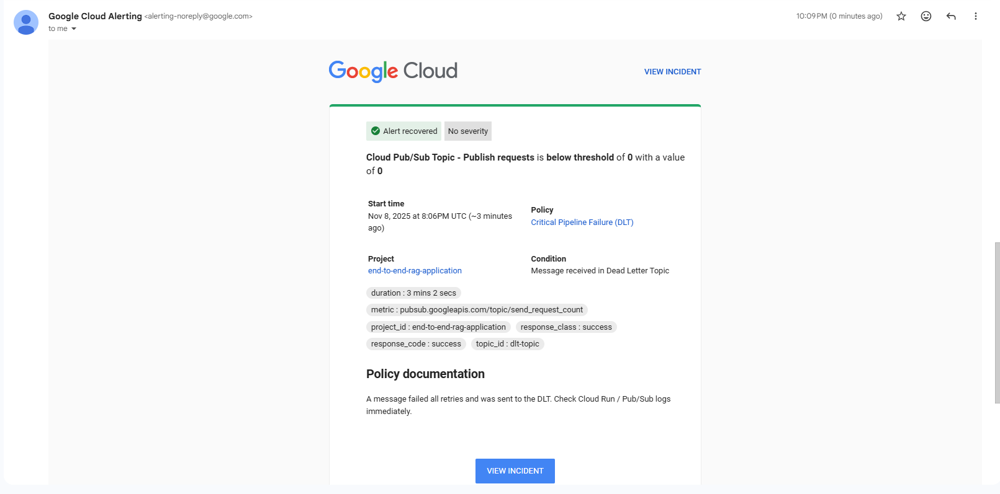

# GCP Event-Driven Media Pipeline

[](https://cloud.google.com/)
[](https://www.terraform.io/)
[](https://github.com/features/actions)
[](https://www.docker.com/)

This project is a fully serverless, event-driven media processing pipeline on **Google Cloud Platform (GCP)**. It automatically processes, analyzes, and stores images upon upload using a "fan-out" architecture.

* **Fully Serverless:** All 6 microservices (frontend, backend, 4 processing functions) run on **Cloud Run**.
* **Event-Driven (Pub/Sub):** An upload to GCS triggers a **Pub/Sub** topic, which fans-out the event to four parallel processing services.
* **Full Terraform Automation (IaC):** All infrastructure (Cloud Run, Pub/Sub, GCS Buckets, IAM, Alerting) is managed by **Terraform**.
* **CI/CD (GitHub Actions):** A complete pipeline automates infrastructure (`terraform apply`) and application deployments (builds/pushes Docker images to **Artifact Registry** and updates **Cloud Run** services).
* **Error Handling:** Uses a **Dead-Letter Topic (DLT)** with **Cloud Monitoring** alerts to notify admins of failed processing events via email.

---

## Project Diagram



---

## How it Works (Visual Flow)

### 1. The Upload

The process begins when a user uploads a file via the **Frontend (Cloud Run)**. The frontend requests a "Signed URL" from the **Backend (Cloud Run)**, which allows the browser to upload the file directly to the **Originals GCS Bucket**.



### 2. The Event Trigger (Fan-Out)

The upload to the GCS bucket automatically triggers an event, sending a message to the main **Pub/Sub Topic**. This topic instantly distributes (fans-out) the same message to four parallel **Subscriptions**.



### 3. Parallel Processing

Each subscription triggers a unique **Cloud Run** service, all of which run at the same time:



* **`AI_Labeling`:** Sends the image to the **Vertex AI API** for analysis.
* **`Metadata`:** Extracts image metadata (e.g., size, dimensions).
* **`Media_Thumbnail`:** Creates a thumbnail version of the image.
* **`Media_Display` (Watermark):** Adds a watermark to the image.

### 4. The Result: Stored & Ready

The outputs of the processing services are stored in their final destinations:
* AI labels and metadata are saved in **Firestore**.
* The new thumbnail and watermarked images are saved in the **Processed GCS Bucket**.




### 5. The Viewing Gallery

A user can then visit the gallery, which is served by the **Backend (Cloud Run)**. The backend queries **Firestore** for the data and **GCS** for the images, displaying them all in a simple UI.



---

## Error Handling & Alerting

This pipeline is built for reliability. If any processing service fails (e.g., due to a bug), the Pub/Sub message is automatically routed to a **Dead-Letter Topic (DLT)**.

A **Cloud Monitoring Alert Policy** is configured to watch this DLT.



When a message lands in the DLT, the alert is triggered, and an **Email Notification** is immediately sent to the administrator to investigate the failure.



---

## Project Demo

See the full pipeline in action, from upload to processing and viewing:

[Watch the Video Demo](Assets/Video.MP4)

---

## Infrastructure & CI/CD

* **Compute:** 6x **Cloud Run** services (Frontend, Backend, AI_Labeling, Metadata, Media_Thumbnail, Media_Display).
* **Storage:** 3x **GCS Buckets** (Originals, Processed, Terraform State) and a **Firestore** database.
* **Eventing:** **Pub/Sub** (Main Topic, DLT, and 4 Subscriptions).
* **AI & ML:** **Vertex AI** API Endpoint for image analysis.
* **CI/CD:** **GitHub Actions** workflows.
* **Registry:** **Artifact Registry** hosts the Docker images for all services.
* **Alerting:** **Cloud Monitoring** Alert Policy and Notification Channels.
* **Security:** **Least Privilege** principles applied, with dedicated **Service Accounts** (`iam.tf`) for each service, ensuring minimal permissions.

The CI/CD pipeline is fully automated:
* **Infrastructure:** A push to the `Terraform/` directory triggers a GitHub Action to run `terraform apply`, provisioning all GCP resources. The **Terraform state** is stored remotely in a dedicated GCS bucket.
* **Application:** A push to any service directory (e.g., `Metadata/`) triggers a GitHub Action to:
    1.  Build a new Docker image.
    2.  Push the image to **Artifact Registry**.
    3.  Deploy the new image to the corresponding **Cloud Run** service.

---

## Project Structure

```bash
.
├── AI_Labeling/             # Cloud Run: Calls Vertex AI, stores labels in Firestore
│   ├── Dockerfile
│   ├── main.py
│   └── requirements.txt
├── Assets/                  # All README images, diagrams, and videos
│   ├── Alert_Email.png
│   ├── Alert_Policy.png
│   ├── Buckets.png
│   ├── Cloud_Runs.png
│   ├── FireStore.png
│   ├── Gallery.png
│   ├── GCP-Event-Media-Pipeline-Diagram.html
│   ├── GCP-Event-Media-Pipeline-Diagram.png
│   ├── GCP-Event-Media-Pipeline-Diagram.svg
│   ├── Notification_channels.png
│   ├── Subscriptions.png
│   ├── Uploaded.png
│   └── Video.MP4
├── Backend/                 # Cloud Run: Serves Gallery, provides Signed URLs
│   ├── Dockerfile
│   ├── ...
│   └── requirements.txt
├── Frontend/                # Cloud Run: Static HTML/JS page for uploading
│   ├── Dockerfile
│   ├── ...
│   └── requirements.txt
├── Media_Display/           # Cloud Run: Adds watermark to images
│   ├── Dockerfile
│   ├── ...
│   └── requirements.txt
├── Media_Thumbnail/         # Cloud Run: Generates thumbnails
│   ├── Dockerfile
│   ├── ...
│   └── requirements.txt
├── Metadata/                # Cloud Run: Extracts and stores image metadata
│   ├── Dockerfile
│   ├── main.py
│   └── requirements.txt
├── Terraform/               # All Infrastructure as Code (IaC) files
│   ├── alert.tf
│   ├── backend.tf           # Configures remote state GCS bucket
│   ├── compute.tf           # Defines all Cloud Run services
│   ├── iam.tf
│   ├── main.tf
│   ├── modules/
│   ├── outputs.tf
│   ├── provider.tf
│   ├── pubsub.tf
│   ├── storage.tf           # Defines GCS buckets
│   ├── terraform.tfvars
│   └── variables.tf
└── README.md